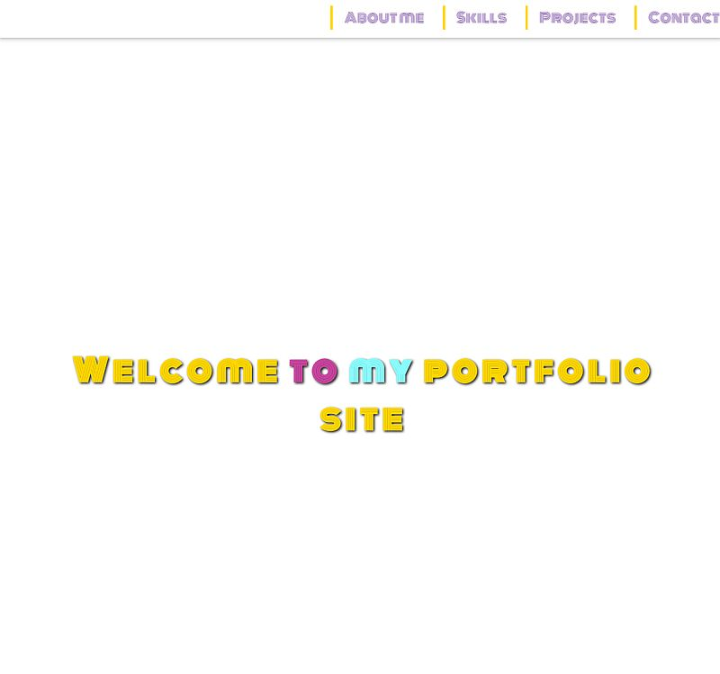
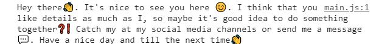
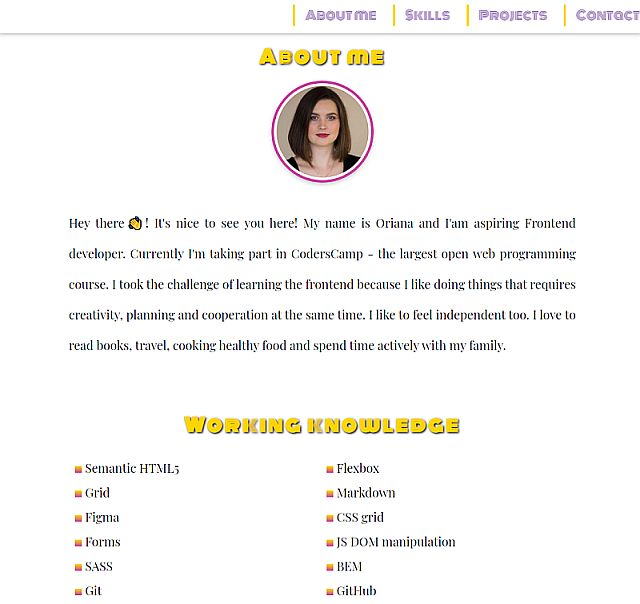
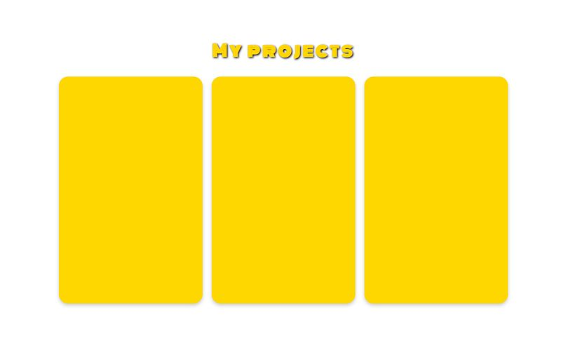
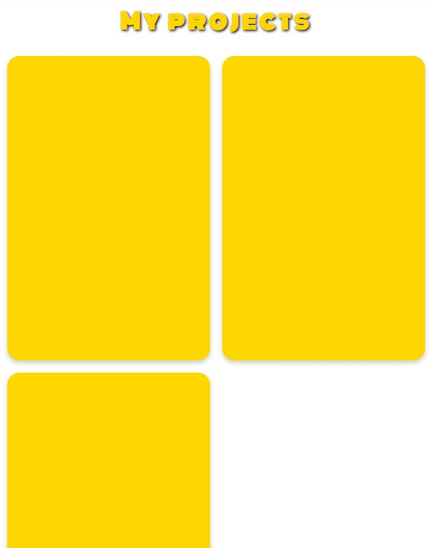
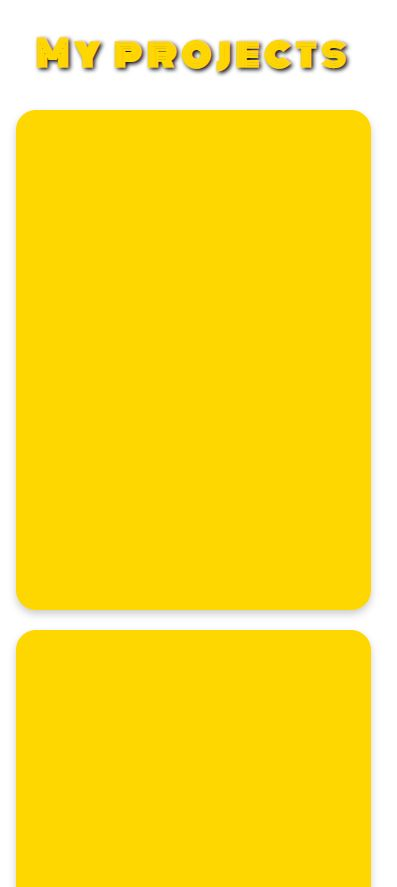
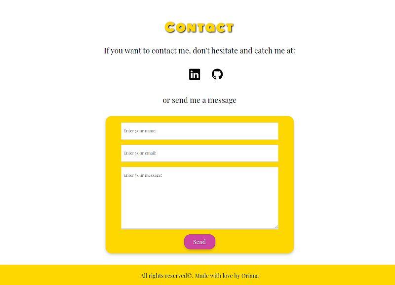
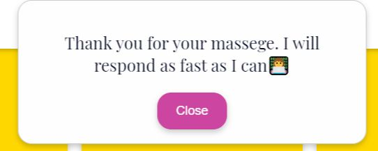
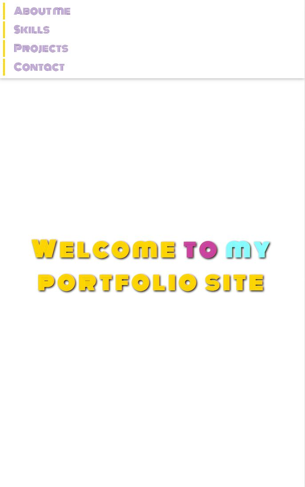

# Portfolio project
This is the first project for CodersCamp course. The goal was to create a portfolio containing information about the author and completed projects.
You can preview demo of this project here: https://orianakj.github.io/codersCamp-portfolio/

## The project should include:
- box-model
- cascade
- CSS selectors
- popular HTML tags
- CSS connection with HTML
- saving colors
- text styling
- external icons / fonts (fontawesome, google fonts)
- flexbox / grid
- position (absolute, relative)
- keyframes animations
- bootstrap
In small projects like this it is not necessary to use flex, grid and bootstrap.

## What additional functionalities does my project have?
- contact form with the modal that is launched after clicking the send button
- media queries for screens with max-width: 500px and max-width: 768px
- custom console.log message

## Portfolio sections
The project was divided into 5 sections:
- welcome screen
- information about me
- my skills
- my projects
- contact section

### About me and working knowledge section
Abaout me section contains some description of me and what I'm interested in and why I started learning programming. In working knowledge section you can find a list of my hands on skills.

### My project section
Here, there are currently empty cards that, along with new projects, will be exchanged for short project information with a screenshot.
In my design, depending on the screen size, there is different number of columns displayed. 

Three columns for screens over 768px:

Two columns for sizes over 500px:

One column for smaller resolutions:

### Contact section
This section contains links to my social media and contact form.

After clicking on the send button of the form, a modal is displayed in which I have included brief information that I will answer the questions as soon as possible.

### Menu in the responsive version
In this portfolio, the menu has been glued to the top of the window and is available at all times for ease of use

